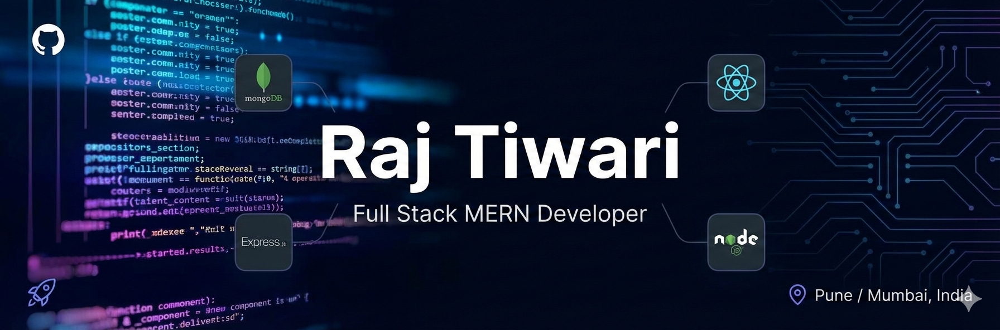

  
   
  <h1>Hi there, I'm Raj Tiwari! 👋</h1>
  <h3>Full Stack MERN Developer | React | Node.js | MongoDB</h3>

  

    
    
    
  

  
📍 Pune / Mumbai, India | 📞 +91-8104032697

---

## 🚀 Professional Summary
Full Stack Developer passionate about building scalable web applications. I have experience working on **real-world ERP systems** and **E-commerce platforms**. My expertise lies in the **MERN stack**, aiming to build high-performance, real-time applications.

---

## 🛠 Tech Stack

**Frontend:**
 

**Backend:**
 

**Database & Tools:**
 

---

## 📊 GitHub Stats

  
  

  

---

## 🧑‍💻 Work Experience

### **Software Developer @ Senwell Group (Dubai Project)**
*📅 Dec 2025 – Present | Pune, India*

> *Working on high-traffic E-commerce solutions.*

- ⚡ **Full Stack Development:** Architecting responsive UI components using **React** and robust backend logic with **Node.js**.
- 🛠 **API Integration:** Seamlessly integrated 15+ RESTful APIs, ensuring data consistency between frontend and backend.
- 🤝 **Client Collaboration:** Directly communicating with stakeholders to refine requirements, resulting in accurate feature delivery.

### **SDE @ Digital Advance Software Pvt. Ltd.**
*📅 May 2025 – Nov 2025 | Mumbai, India*

- 🏦 **ERP Systems:** Engineered financial modules and payment planning systems for enterprise clients.
- 🐛 **Optimization:** Identified and fixed critical bugs, improving system stability and uptime.
- 📈 **Feature Enhancement:** Added new functional modules based on client feedback using PHP/MySQL (XAMPP environment).

---

## 💡 Top Projects

### 🔹 [CodeShare Pro](LINK_TO_REPO_HERE) (Real-Time Editor)
**Tech:** React, Node.js, Socket.io, MongoDB
*A collaborative code editor allowing multiple users to write and execute code simultaneously.*
- ⚡ Implemented **WebSockets (Socket.io)** for sub-100ms real-time typing synchronization.
- 🔒 Built a secure code execution sandbox for JavaScript & Python.
- 📂 **Architecture:** Scalable room-based logic planned for Redis scaling.

### 🔹 [Hotel Management App](LINK_TO_REPO_HERE)
**Tech:** React.js, Next.js, Node.js
*A hotel discovery platform featuring advanced filtering and booking logic.*
- 🎨 Designed a reusable component library, reducing frontend development time by 30%.
- 🔍 Implemented complex search algorithms for Price, Location, and BHK filtering.

---

## 🎓 Education

**Bachelor of Computer Science**
*Mumbai University | 2020 – 2024*
- **GPA:** 8.2/10
- **Relevant Coursework:** Data Structures, Web Engineering, Database Management.

---

  
👇 check out my repositories!

